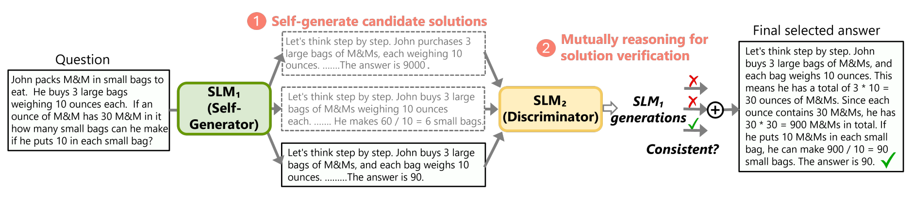
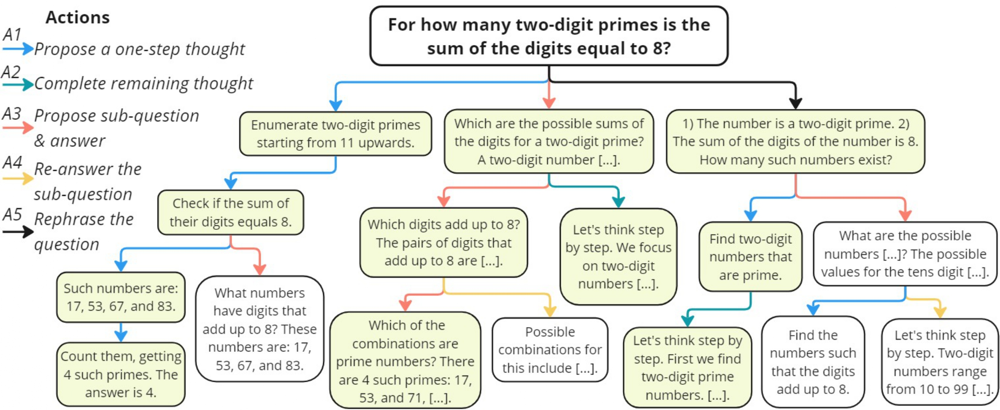
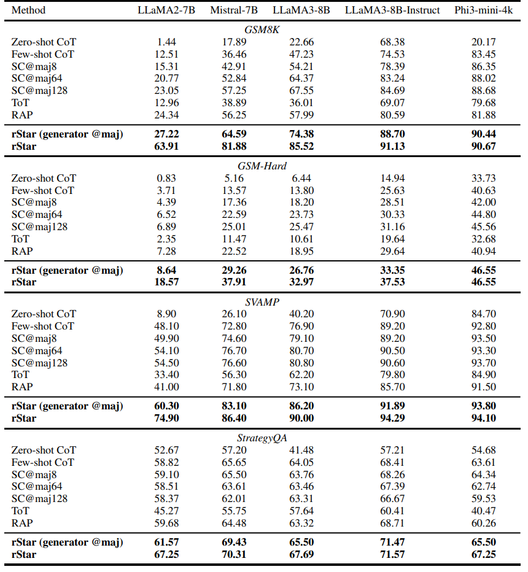

# rStar: Mutual Reasoning Makes Smaller LLMs Stronger Problem-Solvers

This repository contains necessary scripts to run **rStar**'s generator and discriminator.

> Link to paper: https://huggingface.co/papers/2408.06195, https://arxiv.org/abs/2408.06195 

## News
- [01/22/2025] 🎉🎉 rStar is accepted by ICLR 2025!
- [01/09/2025] 🚀🚀 Check out our follow-up work [**rStar-Math**](https://arxiv.org/abs/2501.04519)!
- [10/01/2024] rStar has been recommended as a key technique in [Awesome LLM Strawberry (OpenAI o1)](https://github.com/hijkzzz/Awesome-LLM-Strawberry). Click and read more relevant papers.

## Intro 

We propose **rStar**, a **S**elf-play mu**T**u**A**l **R**easoning approach that significantly improves reasoning capabilities of small language models (SLMs) without fine-tuning or superior models. rStar decouples reasoning into a self-play mutual generation-discrimination process.

<p align="center">
  
</p>

First, a target SLM augments the Monte Carlo Tree Search (MCTS) with a rich set of human-like reasoning actions to construct higher quality reasoning trajectories. Next, another SLM, with capabilities similar to the target SLM, acts as a discriminator to verify each trajectory generated by the target SLM. The mutually agreed reasoning trajectories are considered mutual consistent, thus are more likely to be correct.

**rStar** decomposes reasoning into solution generation and mutual verification. As for solution generation, we introduce a richer set of human-like reasoning actions that allows for thorough space exploration across diverse reasoning tasks. As for mutual verification, we use another SLM as a discriminator to augment the MCTS process, mutually verifying the correctness of each trajectory with the generator SLM.

An overview of the MCTS process with rStar is shown below:
<p align="center">
  
</p>


## Prerequisites

- Python 3.10
- CUDA 12
- newest PyTorch
- newest `transformers`
- newest `vllm`

## Usage

### rStar Generator

Here is an example to run rStar generator:

```bash
bash scripts/run_gsm8k_generator.sh
```

The script `run_gsm8k_generator.sh` includes several configurable parameters:
- `--dataset_name`: Name of the dataset (choose from [MATH, GSM8K, GSM8KHARD, STG, SVAMP, MULTIARITH]).
- `--test_json_filename`: Filename for the test JSON (default: test_all).
- `--model_ckpt`: Path to the model checkpoint.
- `--note`: Additional note to mark the output folder. Without further arguments, the generator output folder will be `./run_outputs/<dataset_name>/<model_ckpt>/<execute_time>---[<note>]`
- `--num_rollouts`: Number of rollouts (default: 16).

Make sure to adjust these parameters according to your requirements.

#### Evaluate rStar Generator

Here is an example to evalute the results of **rStar** generator
```bash
python eval_src/do_eval.py --dataset_name GSM8K --exp_dir_path <generator_output_folder>
```

### rStar Discriminator

Here is an example to run rStar discriminator:

```bash
bash scripts/run_gsm8k_discriminator.sh
```

The script `run_gsm8k_discriminator.sh` includes several configurable parameters:

- `--model_ckpt`: checkpoint Path to the discriminator model.
- `--root_dir`: Path of evalution result folder.
- `--dataset_name`: Name of the dataset (choose from [MATH, GSM8K, GSM8KHARD, STG, SVAMP, MULTIARITH]).
- `--note`: Additional note to mark the output folder. Without further arguments, the discriminator output folder will be `<root_dir>/dis_<execute_time>---<note>`

## Results

Extensive experiments across five SLMs demonstrate rStar can effectively solve diverse reasoning problems. rStar boosts GSM8K accuracy from 12.51% to 63.91% for LLaMA2-7B, from 36.46% to 81.88% for Mistral-7B, from 74.53% to 91.13% for LLaMA3-8B-Instruct.

<p align="center">
  
</p>


## Citation

If you find our work helpful, please consider citing it:
```
@misc{qi2024mutual,
    title={Mutual Reasoning Makes Smaller LLMs Stronger Problem-Solvers},
    author={Zhenting Qi and Mingyuan Ma and Jiahang Xu and Li Lyna Zhang and Fan Yang and Mao Yang},
    year={2024},
    eprint={2408.06195},
    archivePrefix={arXiv},
    primaryClass={cs.CL}
}
```
